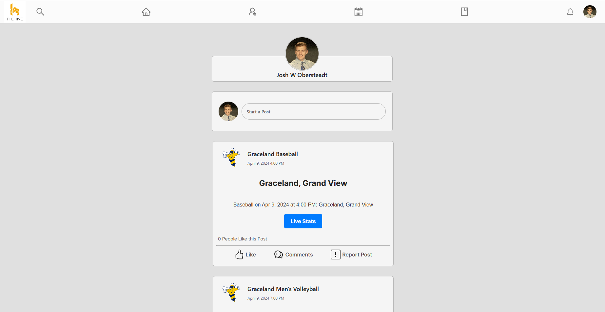
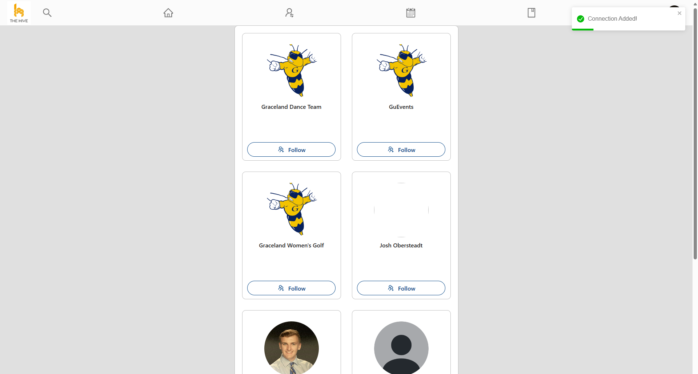
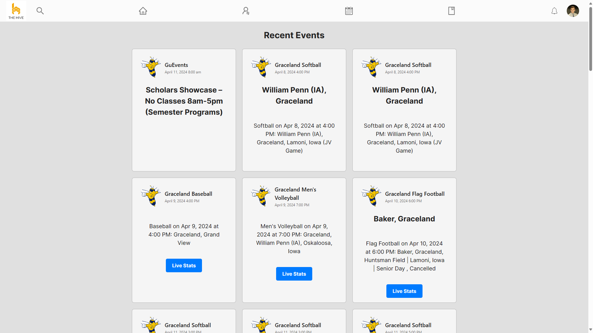

# GUBUZZ
Connecting students and keeping them informed about campus changes and events is a significant challenge for colleges nationwide. Despite various attempts using automated emails, poster boards, and student hires, success has proven elusive. Enter Hive: the ultimate solution to this predicament.

Our innovative social media platform offers students a secure and dependable hub for all campus-related information and experiences. Revolutionizing convenience, our technology streamlines the process for busy students. Gone are the days of cumbersome logins, profile photo uploads, and data entry. With just one click, students activate their accounts, seamlessly integrating their Brightspace information.

Hive also boasts additional features, including automated event feeds, school announcements, and a user-friendly messaging service for effortless peer communication. Embrace the future of campus connectivity with Hive.
# Centeral Feed

The central feature of Hive presents users with a live feed of posts and upcoming events from all the students and organizations they follow. This feed includes options to remove posts, report content, comment, and like posts. These tools create a dynamic platform for students to interact with content across campus.

Future enhancements will integrate with the Brightspace API, allowing students to view upcoming homework and exams and easily create study groups. Recommended academic content will also be tailored to students' majors, creating a centralized feed to incentivize learning.

#Connect Page

To help users thrive and reach new members and communities, the Connections page showcases popular and public users for others to follow. To appear on this page, a user must simply set their profile to public in their user settings.

#Events Page

This page is dedicated to providing students with easy access to upcoming and recent events in one centralized location, regardless of who they follow. It includes a section for recent events like sports games, which can be clicked to view summaries, profiles, or event videos. This information is automatically pulled from various sources for up-to-date details, helping users plan their weeks effortlessly.

#Profile Page

Profiles provide a centralized place for information on users or organizations. Each user has a unique page at GUHive/username, making it easy to look up and index users. Profiles also include a feed showing the history of all their posts.

#Login/Register Page

To create the simplest user experience, users will not need to enter their information when signing up or logging into Hive. Using Brightspace's OAuth 2.0, all information will be pulled into the user's account, allowing for quick access and instant updates of any user information each time they log in.

